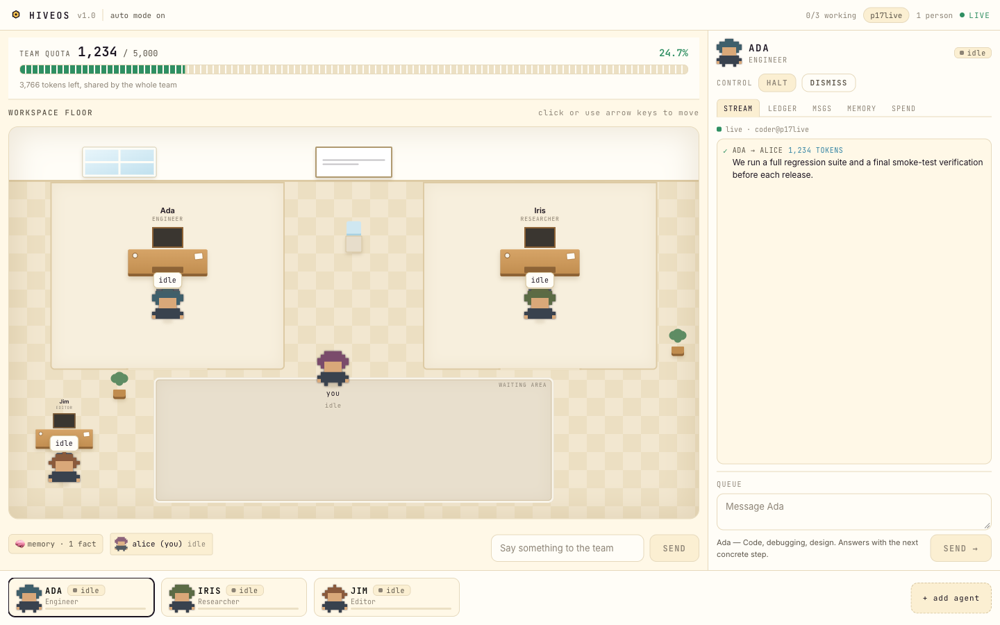
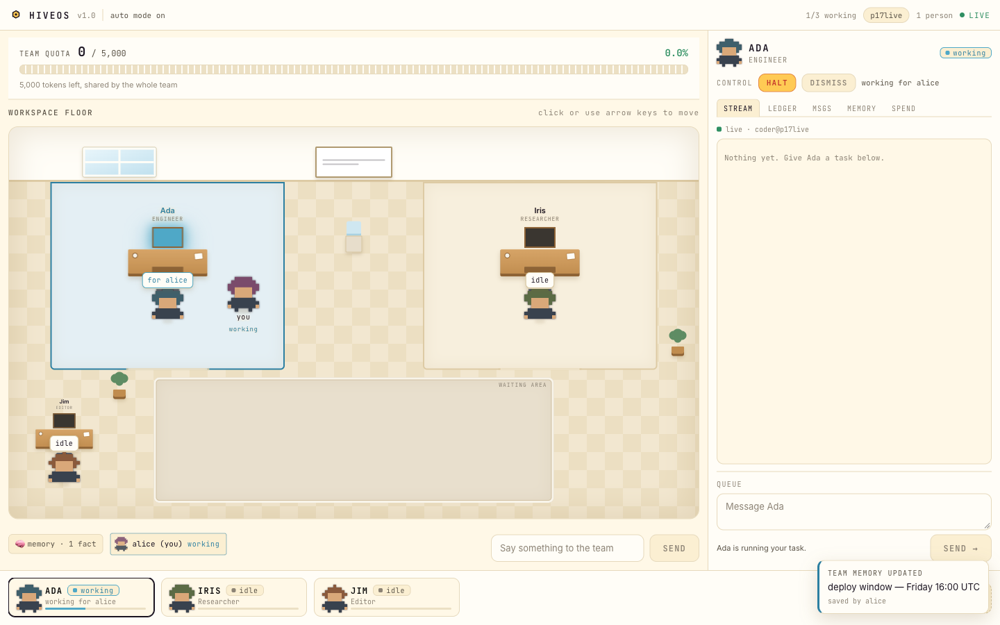
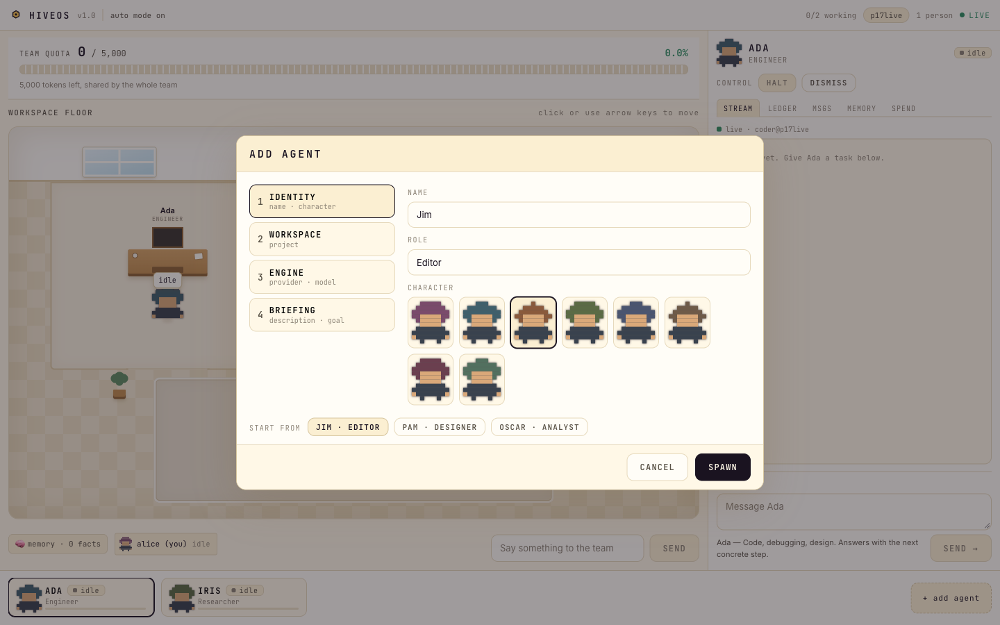

<div align="center">

# HiveOS

**A cloud office where a team hires and runs a floor of AI agents together.**
Watch them work at their desks in real time, on one shared, server-enforced token budget.

[**Open the live workspace →**](https://main.dbavt8jr66qxx.amplifyapp.com) · [**Watch the 3-minute walkthrough**](https://www.youtube.com/watch?v=VBSuDCQa4y4)

No sign-in, no setup. Pick a name and you are on the floor.

[](LICENSE)
[](ARCHITECTURE.md)
[](frontend/)

</div>



---

## Why

Teams sharing AI agents have no visibility into usage, no fairness mechanism for access, and no
real-time governance over token spend. One heavy agentic task can drain a monthly budget in
minutes and nobody sees it happen.

- Uber burned its entire 2026 AI coding budget in four months — one internal demo cost \$1,200 in
  two hours *(Fortune / The Information, May 2026)*
- 79% of enterprises had AI cost overruns in the past 12 months *(DoiT / Sapio Research, Feb 2026)*
- Only 36% of organisations have any token or usage controls *(PointFive Research, Jul 2026)*

Dashboards report yesterday. The gap is **real-time, shared, enforced** governance: who is using
the agents right now, what it is costing, whose turn is next, and what happens when the budget
runs out.

Operating systems solved exactly this for CPU fifty years ago — scheduling, quotas, fair
queueing. HiveOS applies that abstraction to a team's shared AI compute, and then puts it
somewhere you can actually look at it: a floor, with desks, with agents at them.

---

## What it does

### The floor

A workspace is an office you walk into. Agents sit at desks; the people who asked for them stand
beside them. A desk lights up when its agent is working, and the person who asked walks over to
it — live, on every screen at once, not just the screen that clicked.



### Staffing it

A new workspace opens with two agents — Ada, who takes engineering work, and Iris, who
researches. Any member can hire more, up to four: name them, give them a role and a character,
and brief them with a persona that becomes their system prompt. They walk onto the floor and take
a desk. Dismiss them and the desk goes with them — though never the last one; a floor always has
somebody on it.



### The governance underneath

- A team shares one **token budget**, and the meter is **identical on every member's screen**
- The budget is an **enforced ceiling, not a gauge** — the server refuses to call the model once
  the workspace is at its limit, and not one token is spent past it
- Asking for a specific agent is a **preference, not a booking** — if Ada is busy, another free
  agent takes the work, and the reply and the ledger both say who actually ran it
- When every desk is busy, further requests **queue** with a real position, visible team-wide
- A freed desk **auto-dispatches** the next queued task — nobody has to re-ask
- A **per-person spend ledger** records who spent what, and which agent ran it

### What the agents share

**Team memory.** A fact one member saves is loaded into the next member's agent before their task
starts, via model-invoked tools rather than string-stuffing.

**Handoff.** An agent can pass work to another desk when it is a better fit — the envelope
crosses the floor, the receiving agent answers, and both legs bill to the same budget under one
task id. Bounded to one hop, so a chain cannot ping-pong through the budget.

### Workspaces

Each is fully isolated — its own budget, agents, queue, memory and ledger — created on first join
with no provisioning step, and optionally **passphrase-protected** with an owner who can set the
budget or delete it.

### Worlds

The same board can wear a different place. A picker — in the title bar on the floor, and in the
nav on the front page — swaps the whole workspace between nine looks: **Paper Office** (warm
daylight and cream tiles), **Night Watch** (a deck under a star field, lit by its instruments),
**Enchanted Forest** (hollow stumps and carved benches under a dappled canopy), **Reef Station**
(research domes on the seabed, under caustics from a surface far above), **Alien Colony** (command
modules on landing pads under two moons), **Cloud City** (a sky harbour of platforms and
pavilions, above the cloud line), **Arctic Base** (cabins and antenna masts on packed snow, under
a winter aurora), **Desert Outpost** and **Ancient Ruins**. Same sockets, same scheduler, same
rows in DynamoDB, re-dressed. It is a personal setting, stored in your own browser, and it changes
nothing anyone else sees.

A world is never allowed to change what anything *means*. The busy blue, the queued ochre, the
budget jade and the over-budget red carry the whole governance story, so each is re-tuned for its
world's surfaces and **measured** — every state hue clears 4.5:1 against all eight of that world's
surfaces — and none is ever reassigned. What changes is the form: a working desk is a lit monitor
in the office, a lit observation dome on the night deck, and a lit antenna array on a command
module. Even the handoff re-dresses — the paper envelope becomes a transmission pulse on the
colony, on the same path, at the same 1100 ms, with the same screen-reader announcement.

---

## How it works

```
Browser ──wss──► API Gateway WebSocket ──► Router Lambda ──► DynamoDB
                                                │                 ▲
                                                ▼                 │
                                               SQS ──► Agent Runner Lambda ──► model
```

One DynamoDB table holds everything, partitioned by workspace: the roster (`AGENT#`), the queue
(`QUEUE#`), team memory (`MEMORY#`), the ledger (`TASK#`) and live connections (`CONN#`). A React
frontend on Amplify Hosting. Everything serverless, scaling to zero.

The two invariants the product rests on are both enforced in the **write**, not in a read before
it: the budget ceiling and the last-agent guard are DynamoDB condition expressions, so two
concurrent requests cannot both pass a check that only one of them should.

**Model inference runs on Groq (`openai/gpt-oss-120b`), not on Bedrock.** Bedrock is blocked
account-wide on the account this is deployed from, so the call goes out over HTTPS from the Agent
Runner instead. It sits behind a single seam — `backend/shared/llm.py` — and everything else is
AWS. If the model is ever unreachable the workspace still answers, from composed text, and flags
those token counts `estimated` everywhere they appear, including on the cold-load snapshot. A
degraded answer is never laundered into a billed-looking meter.

Full detail and the reasoning behind every choice, including each rejected alternative:
**[`ARCHITECTURE.md`](ARCHITECTURE.md)**.

---

## Getting started

### Prerequisites

AWS CLI (configured) · AWS SAM CLI · Docker (running) · Node 20+ · Python 3.11+

```bash
brew install aws-sam-cli
aws configure
```

### Configure the model key

The agents need a model API key before they will answer. It is read at runtime from SSM Parameter
Store and never stored in this repository:

```bash
aws ssm put-parameter --name /hiveos/groq-api-key --type SecureString \
  --value 'gsk_...' --region us-east-1 --overwrite
```

Get a free key at <https://console.groq.com> (no card required). Without it the office still
runs — every task falls back to composed text flagged `estimated`.

### Deploy

```bash
# Backend — always --use-container; local Python is newer than the Lambda runtime
sam build --use-container
sam deploy

# Frontend — resolves the WebSocket URL from the stack, builds, zips, publishes
./scripts/deploy-frontend.sh
```

`deploy-frontend.sh` is idempotent: it reuses the existing Amplify app and branch rather than
creating duplicates, and it fails loudly if the WebSocket URL did not make it into the bundle.

Stack outputs (WebSocket URL, table name, queue URL):

```bash
aws cloudformation describe-stacks --stack-name hiveos \
  --query 'Stacks[0].Outputs' --output table
```

### Local development

Against the deployed backend:

```bash
cd frontend
npm install
VITE_WS_URL="$(aws cloudformation describe-stacks --stack-name hiveos \
  --query "Stacks[0].Outputs[?OutputKey=='WebSocketURL'].OutputValue" --output text)" \
  npm run dev
```

Full procedure, troubleshooting and the operational runbook: **[`DEPLOYMENT.md`](DEPLOYMENT.md)**.

---

## Verify

Unit tests need no AWS, but they import `botocore`, so `boto3` has to be present:

```bash
python3 -m venv .venv && .venv/bin/pip install boto3 pytest
.venv/bin/python -m pytest tests/      # 127 passed
```

The frontend's unit tests run on `node --test`, so there is no test runner to install:

```bash
cd frontend && npm test                # 10 passed
```

The end-to-end suite drives the **deployed** system over a real WebSocket — multiple live
clients, fan-out, hiring, handoff, the ceiling, fair queueing, workspace isolation, passphrases
and stale-connection cleanup, all against real AWS:

```bash
pip install websockets
./scripts/reset-demo.sh                # clean floor, SQS drained, Lambdas warm — and verified
python3 scripts/ws_smoke.py            # 113/113
```

`reset-demo.sh` exits non-zero if it finds other people already on the default workspace — the
public URL has real visitors. That is a warning for a clean walkthrough, not a blocker for the
suite: `ws_smoke.py` counts only the connections it opened itself, so it scores 113/113 with
strangers on the floor.

`ws_smoke.py` asks whether the system is **correct**. `scripts/rehearse.py --takes 2` asks
whether a scripted walkthrough works in order and inside the time available, and times every
beat — that one does want a quiet floor.

> **`python3`, not `python`** — a bare macOS install has no `python` on `PATH`.

---

## Repository layout

```
backend/
  router/              Connection lifecycle, claiming, queueing, hiring, broadcast
  agent_runner/        SQS consumer, agent execution, token accounting, dispatch
  shared/agents.py     The roster as data — hire, dismiss, personas, the MAX_AGENTS cap
  shared/scheduler.py  Desk claiming, the fair queue, auto-dispatch
  shared/memory.py     Team memory — MEMORY# rows, context loading, memory_updated
  shared/llm.py        The one seam the model call lives behind
  shared/              Broadcast helper, task history, DynamoDB access
frontend/
  src/useHive.js       WebSocket client — owns all board state, reconnect, re-sync
  src/App.jsx          Entry gate, app shell, routing
  src/components.jsx   The floor, the quota strip, the inspector, the roster strip
  src/addagent.jsx     The four-step hire form
  src/landing.jsx      The front door at `/`
  src/sprites.js       The pixel characters, derived from a marker string
  src/worlds/          One stylesheet per world
tests/                 Unit tests — no AWS, no moto
scripts/               Seeding, reset, end-to-end suite, rehearsal, frontend deploy
template.yaml          SAM — all AWS infrastructure
```

---

## Scope and limitations

**Not built:** user accounts. Workspaces can be passphrase-protected and have an owner, but there
is no identity behind a display name — administration hangs off a secret the creator holds, not
off who anyone claims to be. Also unbuilt: any retention policy on the task ledger.

**Deliberately excluded:** authentication, game-engine graphics, token-level preemption,
calendar/email integrations, a per-agent model picker. `PRD.md` and `ARCHITECTURE.md` record why
each was rejected.

**The deployed URL is public and unauthenticated by design** — which is exactly why the
server-side token ceiling is not optional.

---

## Documentation

| File | Read it for |
|---|---|
| [`ARCHITECTURE.md`](ARCHITECTURE.md) | System design, and every rejected alternative with its reason |
| [`CONTRACT.md`](CONTRACT.md) | Schemas, protocol frames, and interfaces that must not drift |
| [`DEPLOYMENT.md`](DEPLOYMENT.md) | AWS setup, deploy commands, operational runbook, troubleshooting |
| [`PRD.md`](PRD.md) | What the product is, what it must do, and what it never will |
| [`CLAUDE.md`](CLAUDE.md) | How to work on this codebase — conventions, workflow, guard rails |
| [`docs/ARTICLE.md`](docs/ARTICLE.md) | A written account of how it was built and what it cost to learn |
| [`docs/internal/`](docs/internal/) | The build record — phase plans, execution log, walkthrough script |

---

## Built with

AWS Lambda · API Gateway WebSocket · DynamoDB · SQS · SSM Parameter Store · AWS SAM · Amplify
Hosting · React + Vite

---

## License

[MIT](LICENSE) © Arunish Rajput
